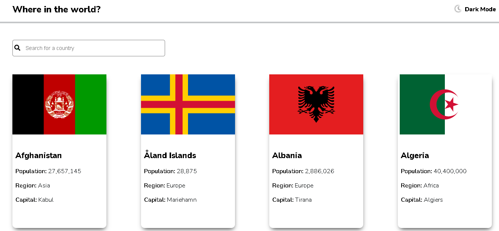
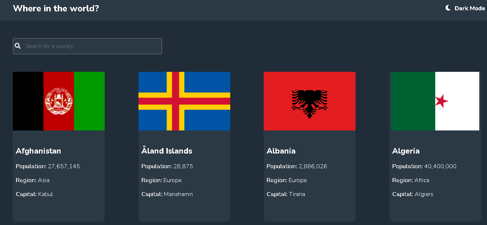
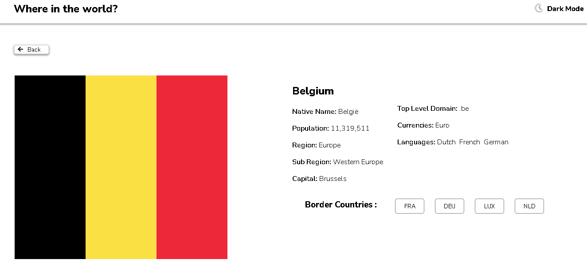
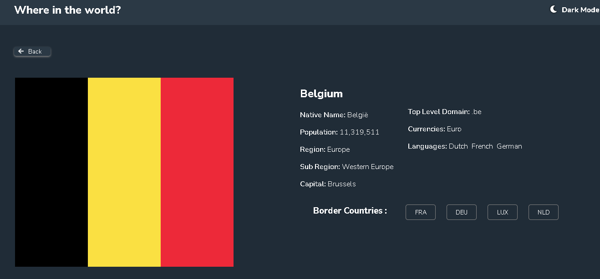

# COUNTRIES DATA APP

This is a web application that displays information about different countries from an API. It was built with css grid and REACT

## Table of contents

- [Overview](#overview)
  - [Screenshot](#screenshot)
  - [Link](#link)
  - [Built with](#built-with)

## Overview
This is a web application that displays information about different countries from an API. The application simply fetches information about countries from an API. Users can easily use the search feature to search for their countries of interest and get some information about the country like region, language, currency, capital, population e.t.c. Users can also switch between light mode and dark mode. The app is responsive on different screen sizes.

### Screenshot

### Link
- Live Site URL: (https://franklynwisdom.github.io/different-breeds-of-dogs/)

### Built with

-CSS GRID AND REACT
